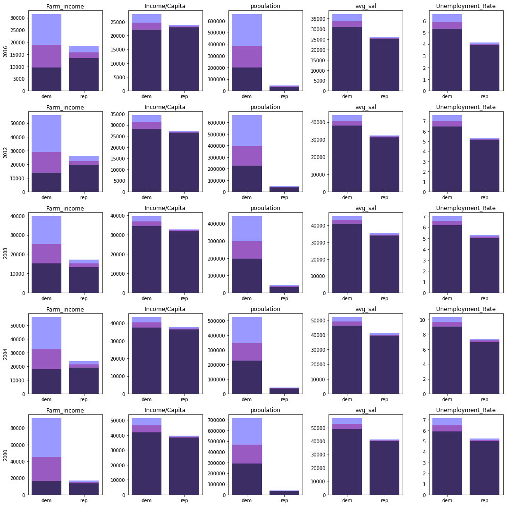

# Voting_econ_profiles
2000-2016
#### Index
-- See "Files" contains the pkl tables of parsed data. The general tables to derive data are split by Election Year "table120{yr}.pkl". There are pearson correlation tables by presidential candidate labeled "{D or R}corr{President Last Name}{yr}.pkl". The rest are various data sources. 

-- 

## Background
Back in 2016, I was discussing the upcoming election with a friend of mine. He claimed that this year (2016), voters are going to be highly motivated by economic issues, much more than other years. With the outcome of the election still a fresh wound, I used that discussion as a starting point to explore how much economic variables correspond with voting outcomes.

## Data
Economic data is pulled from the Bureau of Labor Statistics and the Bureau of Economic Analysis. The parameters include a raw job count, Farm income, Income/capita, Population, Average Salary, Labor Force, and the Unemployment Rate. Voting data is pulled from Harvard's county voting data. 

Each quality and voting result is associated with a particular county. The counties are defined by their FIPS code. Unfortunately, the FIPS code is not consistent with the state of Alaska, and some data is lost. Still, the results are mostly in tact, and the loss of the represented population is only about 1% of the US population. 

## Results
The Results are listed in the tables below. There is clear and stable correlation for each economic feature for each political party's presidential candidate. The economic factors do not particularly more relevant for the voting outcome of 2016 than other election years, but, of course, these are economic qualities of the district and not the particular policies of the candidate.  
\
\
Year-by-year correlations\

\
\
95% Confidence interval for 20pt voting margin counties, (dark= lower, mid= avg, light=upper)\

